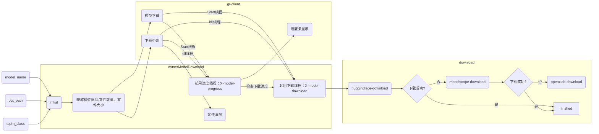
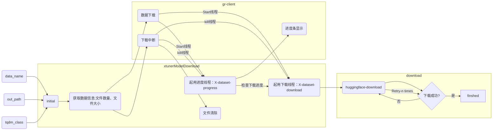

## 模型下载

核心流程


- example:
```python
from download_model import xtunerModelDownload
from tqdm.auto import tqdm
import time 

model_name = 'internlm/internlm-chat-7b'
d_model = xtunerModelDownload(
    model_name,
    out_path='/root/tmp/download_model',
    tqdm_class=tqdm
)
d_model.auto_download()
time.sleep(60)
d_model.break_download()
print('Yes')
```

## 数据下载


核心流程


- example:
```python
from download_dataset import xtunerDataDownload
from tqdm.auto import tqdm
import time 

data_name = 'shibing624/medical'
d_data = xtunerDataDownload(
    data_name,
    out_path='/root/tmp/download_data',
    tqdm_class=tqdm,
    retry_times=1
)
d_data.auto_download()
time.sleep(60)
d_data.break_download()
print('Yes')
```


